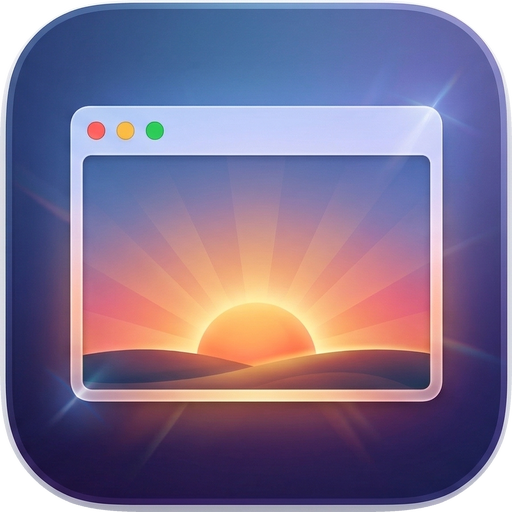
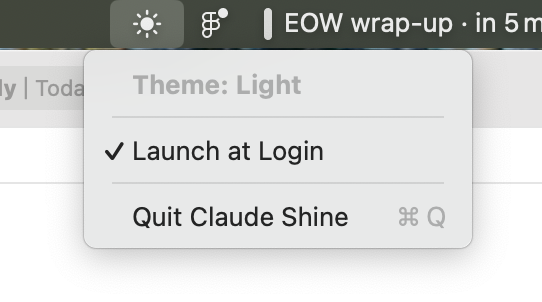
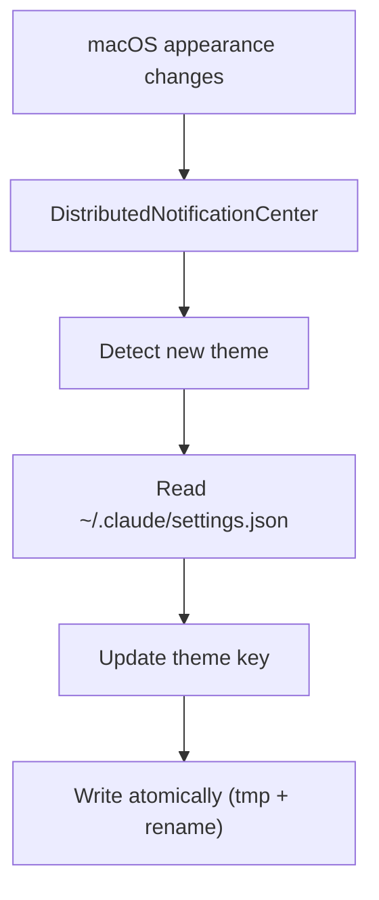

<div align="center">



# Claude Shine

**Automatic dark mode for
[Claude Code](https://docs.anthropic.com/en/docs/claude-code).**

[](https://www.apple.com/macos/)
[](LICENSE)
[](https://tuist.dev)

</div>

---

Claude Code doesn't follow your system appearance. Every time you toggle dark
mode on macOS, you have to manually type `/theme light` or `/theme dark`. Claude
Shine fixes that.

It sits in your menu bar, watches for appearance changes, and updates
`~/.claude/settings.json` instantly. No polling, no CPU usage when idle, no
config — just install and forget.

<div align="center">

</div>

## Features

- **Instant sync** — theme updates the moment macOS appearance changes
- **Zero overhead** — notification-driven, not polled; uses no CPU when idle
- **Menu bar native** — sun/moon icon reflects current theme; no Dock icon
- **Launch at Login** — one-click toggle in the menu bar dropdown
- **Non-destructive** — preserves all existing settings in `settings.json`
- **Atomic writes** — temp file + rename prevents corruption, even on crash

## Install

### Download

1. Grab **ClaudeShine.zip** from the
   [latest release](https://github.com/skeswa/claude-shine/releases/latest)
2. Unzip and move `ClaudeShine.app` to `/Applications`
3. **First launch:** right-click the app → **Open** (required once for unsigned
   apps)

> **Tip:** If macOS still blocks the app, run
> `xattr -cr /Applications/ClaudeShine.app` then open normally.

### Build from source

Requires [mise](https://mise.jdx.dev/) (`brew install mise`).

```bash
git clone https://github.com/skeswa/claude-shine.git
cd claude-shine
mise install   # installs Tuist
mise run install
```

This builds a Release binary and copies `ClaudeShine.app` to `/Applications`.

## How it works



The entire app is ~200 lines of Swift. Four files, no dependencies, no
frameworks beyond AppKit and SwiftUI.

| Component               | Responsibility                                    |
| ----------------------- | ------------------------------------------------- |
| `AppearanceMonitor`     | Subscribes to system notifications, detects theme |
| `ClaudeSettingsManager` | Reads/writes `settings.json` atomically           |
| `Theme`                 | `light` / `dark` enum                             |
| `ClaudeShineApp`        | Menu bar UI, Launch at Login toggle               |

## Development

```bash
mise run generate    # Generate Xcode project
mise run build       # Release build
mise run test        # Run 19 unit tests
mise run clean       # Remove build artifacts
```

The project uses [Tuist](https://tuist.dev) for declarative Xcode project
generation — no `.xcodeproj` checked into the repo. All dependencies are
injected, so the full test suite runs without touching the real filesystem or
system APIs.

## Uninstall

```bash
mise run uninstall
```

Or quit the app and delete it from `/Applications`.

## License

[MIT](LICENSE)
